Buena idea. Vamos a integrar un sistema de `bin/` que se gestione también con Stow, manteniendo la misma filosofía de compartido/por-OS.## Estructura completa de `bin/`



```
~/dotfiles/
└── bin/
    ├── shared/
    │   └── .bin/              ← stow lo enlaza a ~/.bin/
    │       ├── mkcd           # bash
    │       ├── git-cleanup    # bash
    │       ├── extract        # bash
    │       ├── json-pretty    # python
    │       └── http-serve     # python
    ├── linux/
    │   └── .bin/
    │       ├── pbcopy         # emula el pbcopy de mac con xclip
    │       └── open           # emula el open de mac con xdg-open
    └── macos/
        └── .bin/
            ├── notify         # wrapper de osascript
            └── brew-dump      # actualiza el Brewfile
```

El directorio destino es `~/.bin/` (con punto) para no colisionar con un posible `~/bin/` del sistema, y se añade al `PATH` desde `shared/zsh/.zshrc`.

---

## Convenciones para los scripts

**Cabecera estándar** para todos los scripts:

```bash
#!/usr/bin/env bash
# mkcd — crea un directorio y entra en él
# uso: mkcd <nombre>
set -euo pipefail
```

Para Python:

```python
#!/usr/bin/env python3
# json-pretty — formatea JSON desde stdin o archivo
# uso: json-pretty [archivo] o echo '...' | json-pretty
```

Sin extensión en el nombre del archivo. El shebang determina el intérprete; el usuario solo escribe `mkcd` o `json-pretty`, nunca `mkcd.sh`.

---

## Ejemplos de scripts útiles

**`shared/.bin/mkcd`**
```bash
#!/usr/bin/env bash
# crea un directorio y entra en él
set -euo pipefail
mkdir -p "$1" && cd "$1"
```

**`shared/.bin/extract`** — descomprime cualquier formato:
```bash
#!/usr/bin/env bash
set -euo pipefail
case "$1" in
  *.tar.bz2) tar xjf "$1"  ;;
  *.tar.gz)  tar xzf "$1"  ;;
  *.tar.xz)  tar xJf "$1"  ;;
  *.zip)     unzip "$1"    ;;
  *.7z)      7z x "$1"     ;;
  *.gz)      gunzip "$1"   ;;
  *)         echo "Formato no reconocido: $1" >&2; exit 1 ;;
esac
```

**`shared/.bin/git-cleanup`** — borra ramas locales ya mergeadas:
```bash
#!/usr/bin/env bash
set -euo pipefail
git branch --merged | grep -vE '^\*|main|master|develop' | xargs -r git branch -d
echo "Ramas limpiadas."
```

**`shared/.bin/json-pretty`**
```python
#!/usr/bin/env python3
import json, sys
src = open(sys.argv[1]) if len(sys.argv) > 1 else sys.stdin
print(json.dumps(json.load(src), indent=2, ensure_ascii=False))
```

**`linux/.bin/pbcopy`** — compatibilidad con el clipboard de mac:
```bash
#!/usr/bin/env bash
xclip -selection clipboard "$@"
```

**`linux/.bin/open`** — compatibilidad con el `open` de mac:
```bash
#!/usr/bin/env bash
xdg-open "$@" &>/dev/null &
```

**`macos/.bin/brew-dump`** — mantiene el Brewfile actualizado:
```bash
#!/usr/bin/env bash
set -euo pipefail
BREWFILE="$HOME/dotfiles/macos/homebrew/Brewfile"
brew bundle dump --file="$BREWFILE" --force
cd "$HOME/dotfiles" && git add "$BREWFILE" && git commit -m "brew: update Brewfile"
echo "Brewfile actualizado y commiteado."
```

---

## Integración en `stow.sh`

Añades un bloque para `bin/` en el script existente:

```bash
#!/usr/bin/env bash
set -euo pipefail

DOTFILES="$HOME/dotfiles"
OS=$(uname -s)

stow_pkg() {
  stow -d "$1" -t "$HOME" "$2"
}

# Configs compartidas
stow_pkg "$DOTFILES" shared

# Scripts bin compartidos
stow_pkg "$DOTFILES/bin" shared

case "$OS" in
  Linux)
    stow_pkg "$DOTFILES" linux
    stow_pkg "$DOTFILES/bin" linux
    ;;
  Darwin)
    stow_pkg "$DOTFILES" macos
    stow_pkg "$DOTFILES/bin" macos
    ;;
esac

# Asegura permisos de ejecución en todos los scripts
chmod +x "$HOME"/.bin/*
echo "Dotfiles y scripts aplicados en $OS"
```

---

## PATH en `shared/zsh/.zshrc`

```bash
# Scripts personales (gestionados con stow)
export PATH="$HOME/.bin:$PATH"
```

Con esto, al abrir cualquier terminal en Linux o macOS, todos los scripts compartidos y los específicos de tu sistema estarán disponibles directamente por nombre. Añadir un nuevo script es tan simple como crear el archivo en `bin/shared/.bin/` o en el directorio del OS correspondiente, darle permisos con `chmod +x`, y hacer commit.
